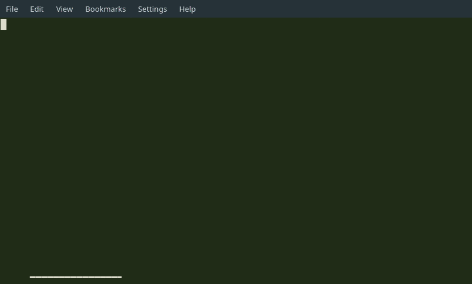

```
________...........__________.........___...............__...
\______.\.._______.\______...\..____..\_.|__....____.._/..|_.
.|....|..\.\_..__.\.|......._/./.._.\..|.__.\../.._.\.\...__\
.|....`...\.|..|.\/.|....|...\(..<_>.).|.\_\.\(..<_>.).|..|..
/_______../.|__|....|____|_../.\____/..|___../.\____/..|__|..
........\/.................\/..............\/................
```
[](https://github.com/sandialabs/dr_robot/blob/master/LICENSE)
[](https://travis-ci.org/sandialabs/dr_robot)

Copyright 2019 National Technology & Engineering Solutions of Sandia, LLC (NTESS). Under the terms of Contract DE-NA0003525 with NTESS, the U.S. Government retains certain rights in this software.

# Table of Contents

  * [Introduction](#introduction)
  * [Configurations](#configurations)
     * [Example Configuration For WebTools](#example-configuration-for-webtools)
     * [Example Configurations For Docker Containers](#example-configurations-for-docker-containers)
     * [Docker Integration and Customization](#docker-integration-and-customization)
     * [Adding Docker Containers](#adding-docker-containers)
  * [Dependencies](#dependencies)
  * [SSH   Ansible](#ssh--ansible)
  * [Output](#output)
     * [SQLite DB files](#sqlite-db-files)
  * [Serve](#serve)

## Introduction

Dr. ROBOT is a tool for **Domain Reconnaissance and Enumeration**. Utilizing a few virtualization technologies to reduce the environmental load on an individuals computer as well as retaining strong versioning allows Dr. ROBOT to be a highly configurable and portable tool.

**Use Case**: Quickly gather as many public facing servers that a target may possess. By querying DNS resources we can quickly develop a large list of possible targets that you can run further analysis on.

**Note**: Dr. ROBOT is not just a one trick pony. You can easily customize the tools that are used gather information, so that you can enjoy the benefits of using latest and greatest along with your battle tested favorites.

**Install and Run**



**Command Examples**

* Run gather using Sublist3r and Aquatone and Shodan
    ``` 
    python drrobot.py example.domain gather -sub -aqua -shodan 
    ```
* Run gather using Sublist3r with Proxy
    ```
    python drrobot.py --proxy http://some.proxy:port example.domain gather -sub
    ```
* Run inspect using Eyewitness
    ```
    python drrobot.py example.domain inspect -eye
    ```
* Run inspect using httpscreenshot and grabbing headers
    ```
    python drrobot.py example.domain inspect -http -headers
    ```
* Run upload using Mattermost (currently the only default)
    ```
    python drrobot.py example.domain upload -matter
    ```

**MAIN**

```buildoutcfg
usage: drrobot.py [-h] [--proxy PROXY] [--dns DNS] DOMAIN
                  {gather,inspect,upload,rebuild,dumpdb} ...

Docker DNS recon tool

positional arguments:
  {gather,inspect,upload,rebuild,dumpdb}
    gather              Run scanners against the given domain and gather
                        resources. You have the option to run using any
                        docker_buildfiles/webtools you may have included in your config.
    inspect             Run further tools against domain information gathered
                        from previous step. Note: you must either supply a file
                        which contains a list of IP/Hostnames orThe targeted
                        domain must have a db under the dbs folder
    upload              Upload recon data to Mattermost. Currently only works
                        with a folder that contain PNG images.
    rebuild             Rebuild the database with additional files/all files
                        from previous runtime
    dumpdb              Dump the database of ip,hostname,banners to a text
                        file
    output              Generate output in specified format. Contains all 
                        information from scans (images, headers, hostnames, ips) 
                        found in database files. 

optional arguments:
  -h, --help            show this help message and exit
  --proxy PROXY         proxy server URL to set DOCKER http_proxy too
  --dns DNS             DNS server to add to resolv.conf of DOCKER containers
  --domain DOMAIN       Domain to run scan against
```
**Gather**
```buildoutcfg
usage: drrobot.py gather [-h] [-aqua] [-sub] [-brute] [-shodan] [-arin]
                         [-hack] [-dump] [-virus] [--ignore IGNORE]
                         [--verify VERIFY]

optional arguments:
  -h, --help            show this help message and exit
  -aqua, --Aquatone     AQUATONE is a set of tools for performing
                        reconnaissance on domain names
  -sub, --Sublist3r     Sublist3r is a python tool designed to enumerate
                        subdomains of websites using OSINT
  -brute, --Subbrute    SubBrute is a community driven project with the goal
                        of creating the fastest, and most accurate subdomain
                        enumeration tool.
  -shodan, --Shodan     Query SHODAN for publicly facing sites of given domain
  -arin, --Arin         Query ARIN for public CIDR ranges. This is better as a
                        brute force option as the ranges
  -hack, --HackerTarget
                        This query will display the forward DNS records
                        discovered using the data sets outlined above.
  -dump, --Dumpster     Use the limited response of DNSDumpster. Requires API
                        access for better results.
  -virus, --VirusTotal  Utilize VirusTotal's Observer Subdomain Search
  --ignore IGNORE       Space seperated list of subnets to ignore
  --headers             If headers should be scraped from ip addresses
                        gathered

```
**INSPECT**
```buildoutcfg
usage: main.py inspect [-h] [-httpscreen] [-eye] [--proxy PROXY] [--dns DNS]
                       [--file FILE]
                       

optional arguments:
  -h, --help            show this help message and exit
  -httpscreen, --HTTPScreenshot
                        Post enumeration tool for screen grabbing websites.
                        All images will be downloaded to outfile:
                        httpscreenshot.tar and unpacked httpscreenshots
  -eye, --Eyewitness    Post enumeration tool for screen grabbing websites.
                        All images will be downloaded to outfile:
                        Eyewitness.tar and unpacked in Eyewitness
  --proxy PROXY         proxy server URL to set DOCKER http_proxy too
  --dns DNS             DNS server to add to resolv.conf of DOCKER containers
  --file FILE           (NOT WORKING) File with hostnames to run further
                        inspection on
```

**UPLOAD**

```
usage: drrobot.py upload [-h] [-matter] [--filepath FILEPATH] 

optional arguments:
  -h, --help            show this help message and exit
  -matter, --Mattermost
                        Mattermost server
  --filepath FILEPATH   Filepath to the folder containing imagesto upload.
                        This is relative to the domain specified. By default
                        this will just be the path to the output folder
```
**Rebuild**

```
usage: drrobot.py rebuild [-h] [-f [FILES [FILES ...]]]

optional arguments:
  -h, --help            show this help message and exit
  -f [FILES [FILES ...]], --files [FILES [FILES ...]]
                        Additional files to supply outside of the ones in the
                        config file
```
**Dumpdb**

```
usage: drrobot.py dumpdb [-h]

optional arguments:
  -h, --help            show this help message and exit
```

**OUTPUT**
```
usage: drrobot.py domain output [-h] [--output OUTPUT] {json,xml}

positional arguments:
  {json,xml}       Generate json file under outputs folder (format)

optional arguments:
  -h, --help       show this help message and exit
  --output OUTPUT  Alternative location to create output file
```

## Configurations

This tool is highly dependent on the configuration you provide it. Provided for you is a **default_config.json** that you can use as a simple template for your **user_config.json**. Most of the configurations under **Scanners**  are done for you and can be used as is. Note the use of **default** in this and other sections.

> default : specifies a Docker or Ansible instance. Make sure you adjust configurations according to their usage. 

* Docker Configuration Requirements
    * name: Long name to show for description/toolname,
    * default : 1 to specify DOCKER,
    * docker_name: short name for docker tag and commandline,
    * default_conf: name of TMP Dockerfile,
    * active_conf: Name for active config file,
    * description: Description,
    * output: Output directory of tool on remote host. 
* Ansible Configuration Requirements
    * name : "HTTPScreenshot",
    * default : 2,
    * custom_command : commandline function to run with flag substitutes you may need
                        for example **ansible-playbook $flags $config** ,
    * custom_substitutes : Sub dictionary of options to replace in the custom command above. 
    These are usually options that are dependant on runtime items.
    ```json
    {
    "config" : "$config/httpscreenshot_play.yml", 
    "flags": "-e 'infile=$infile',
    "outfile": "$outfile/httpscreenshot.tar",
    "outfolder": "$outfile/httpscreenshots",
    }
    ```

    * description : Description
    * "inputfilelist : filename to look for 
    * enabled : True/False run all the time

Web referencing modules and Forum posting modules are also included in this config. One thing of vital 
importance when configuring these tools.
*  class_name : this must match the name you specify for a given class under the respective module name

The reason behind this is due to the loading of modules at runtime which require the use of *importlib* which 
will load the respective class based off the classname provided at via options provided on the commandline.   

### Example Configuration For WebTools

Under **configs** you will find a default_config which contains a majority of the default scanners you can utilize. If you wish to extend upon the **WebTools** list just follow these steps:

1. In the default_config.json/user_config.json

   ```json
   {
     "WebTools":
     {
       "NewTool" :
       {
         "short_name": "ntool",
         "class_name": "NewTool",
         "description" : "NewTool description",
         "output_file" : "newtool.txt",
         "api_key" : null,
         "endpoint" : null,
         "username" : null,
         "password" : null
       },
   ```

2. Open **src/web_resources.py** make a class with the **class_name** above. ***DO NOT FORGET TO MATCH IT EXACLY***

   ```python
   class NewTool(WebTool):
   	def __init__(self, **kwargs):
   		super().__init__(**kwargs)
   		....
   	def do_query(self):
   		.... do the query ... 
   		store results in
   		self.results
   ```

### Example Configurations For Docker Containers

Under **configs** you will find a **default_config** which contains a majority of the default scanners you can utilize. If you wish to extend upon the **Scanners** list just follow these steps:

1. Add the **json** to the **config** file (user if generated).

   ```
   "Scanners" : {
   	...
       "NewTool": {
           "name": "NewTool",
           "default" : 1, 
           "docker_name": "ntool",
           "network_mode": "host",
           "default_conf": "docker_buildfiles/Dockerfile.NewTool.tmp",
           "active_conf": "docker_buildfiles/Dockerfile.NewTool",
           "description": "NewTool is an awesome tool for domain enumeration",
           "src": "https://github.com/NewTool",
           "output": "/home/newtool",
           "output_file": "NewTool.txt"
         },
         ...
   }
   ```
   1. Note *network_mode* is an option specifically for docker containers. It is implementing the 
      ``` --network ``` flag when using docker

2. Then under the **docker_buildfiles/** folder create your **Dockerfile.NewTool.tmp** dockerfile.

   1. If you desire adding more options at run time to the Dockerfiles look at editing the **src/dockerize**
   2. **Note** as of right now Dockerfiles must come from the **docker_buildfiles** folder. Future work includes allowing to specify a remote source for the docker images. 

### Example Ansible Configuration

Under **configs** you will find a **default_config** which contains a majority of the default scanners you can have. For this step however, we will be looking at configuring an inspection too **Eyewitness** for utilization with **Ansible**.

1. Add the **json** to the **config** file (user if generated).

   ```
   "Enumeration" : {
           "Eyewitness": {
               "name" : "Eyewitness",
               "short_name" : "eye",
               "docker_name" : "eye",
               "mode" : "ANSIBLE",
               "network_mode": "host",
               "default_conf" : "docker_buildfiles/Dockerfile.Eyewitness.tmp",
               "active_conf" : "docker_buildfiles/Dockerfile.Eyewitness",
               "ansible_arguments" : {
                   "config" : "$config/eyewitness_play.yml",
                   "flags": "-e '$extra' -i ansible_plays/inventory",
                   "extra_flags":{
                       "1" : "variable_host=localhost",
                       "2" : "variable_user=root",
                       "3" : "infile=$infile/aggregated_protocol_hostnames.txt",
                       "4" : "outfile=$outfile/Eyewitness.tar",
                       "5" : "outfolder=$outfile/Eyewitness"
                   }
               },
               "description" : "Post enumeration tool for screen grabbing websites. All images will be downloaded to outfile: Eyewitness.tar and unpacked in Eyewitness",
               "output" : "/tmp/output",
               "infile" : "/tmp/output/aggregated/aggregated_protocol_hostnames.txt",
               "enabled" : false
           },
   }
   ```

2. As you can see this one has a few things that may seem confusing at first but will be clarified here:

   1. mode: allows you to specify how you want to deploy a tool you want to use. Currently **DOCKER** or **ANSIBLE** are the only available methods to deploy.

   2. All options outside of **ansible_configuration** will be ignored when developing for **ANSIBLE**.

   3. Options under *ansible_arguments*

      1. **config**: specify which playbook to use

      2. **flags**: which flags to pass to the **ansible-playbook** command. With the exception of the **$extra** flag, you can add anything you would like to be done uniquely here.

      3. **extra_flags** : this corresponds to the **$extra** flag as seen above. This will be used to populate variables that you input into your playbook. You can use this to supply command line arguments when utilizing ansible and Dr. Robot in order to add files and other utilities to your script. 

         1.  **variable_host** : hostname alias found in the inventory file
         2.  **variable_user** : user to login as on the variable_host machine
         3.  **infile**: file to be used with the tool above. Eyewitness requires hostnames with the format ```https://some.url```, hence *aggregated_protocol_hostnames.txt* 
            1.  Note the use of the prefix **$infile**- these names all match as they are placeholders for the default locations that **$infile** corresponds to in **outputs/target_name/aggregated**
            2.  If you have a file in another location you can just specify the entire path without any errors occurring.
         4.  **outfile** : The output file location 
            1.  As with the above infile **$outfile** in the name is just a key to the location **outputs/target_name/**
            2.  You may specify a hard coded path for other use. Just remember the location for uploading or other processing with Dr. Robot
         5.  **outfolder** : The output folder to unpack/download files too
            1.  As with the above infile **$outfile** in the name is just a key to the location **outputs/target_name/**
            2.  This is a special case for Eyewitness and HttpScreenshot, which you can see in their playbooks. They generate a lot of files and rather than download each individually having them pack up the files as a step in the playbook and then unpacking allows for some integrity.
         6.  A quick example below shows how we use the **extra_flags** to supply the hostname to the playbook for ansible.

         ```
         ---
         - hosts: "{{ variable_host|quote }}"
           remote_user: root 
         
           tasks:
               - name: Apt install git
                 become: true
                 apt:
                     name: git
                     force: yes
         ```

         

### Docker Integration and Customization

Docker is relied upon heavily for this tool to function.

All Docker files will have a **default_conf** and an **active_conf**. 

**<u>default_conf</u>** represents the template that will be used for generation of the docker files. The reason for building the docker images is to allow for finer control on the user end, especially if you are in a more restricted environment without access to the docker repositories.

**<u>active_conf</u>** represents the configuration which will be build into the current image.

**example Dockerfile.tmp**

```
FROM python:3.4

WORKDIR /home
ENV http_proxy $proxy
ENV https_proxy $proxy
ENV DNS $dns
ENV TARGET $target
ENV OUTPUT $output

RUN mkdir -p $$OUTPUT

RUN if [ -n "$$DNS" ]; then echo "nameserver $DNS" > /etc/resolv.conf; fi; apt-get install git

RUN if [ -n "$$DNS" ]; then echo "nameserver $DNS" > /etc/resolv.conf; fi; git clone https://github.com/aboul3la/Sublist3r.git /home/sublist

WORKDIR /home/sublist

RUN if [ -n "$$DNS" ]; then echo "nameserver $DNS" > /etc/resolv.conf; fi; pip3 install -r requirements.txt

ENTRYPOINT python3 sublist3r.py --domain $target -o $output/sublist3r.txt
```

We use **ENV** to keep track of most variable input from Python on the user end.

Using the **DNS** information provided by the user we are able to download packages and git repos during building. 

### Ansible Configuration

Please see the ansible documentation: https://docs.ansible.com/ for details on how to develop a playbook for use with DrRobot. 

#### Inventory

Ansible inventory files will be self contained within DrRobot so as to further seperate itself from any one system. The inventory file will be located under **ansible_playbooks/inventory**

As noted in the documentation ansible inventory can be defined as groups or single IP's. A quick example:

```
[example-host]
ip.example.com
```

#### SSH + Ansible

If you desire to run Ansible with this tool and require ssh authentication be done you can use the application as is to run Ansible scripts. The plays will be piped to STDIN/STDOUT so that you may supply credentials if required. 

If you wish to have to not manually provide credentials just use an **ssh-agent**

```
eval $(ssh-agent -s)
ssh-add /path/to/sshkey
```

## 

### Adding Docker Containers

If you wish to add another Dockerfile to the project make a **Dockerfile.toolname.tmp** file within the **docker_buildfiles** folder. Then opening up your **user_config** add a new section under the appropriate section as shown above in the  [docker](#Example Configurations For Docker Containers)

## Dependencies

- **Docker** required for any of the scanners to run

- **Python 3.6** required 

  - **Pipenv** for versioning of all Python packages. You can use the Pipfile with setup.py requirements as well.

    ```
    cd /path/to/drrobot/
    pipenv install && pipenv shell
    python drrobot.py <command> <flags> target
    ```

    

- **Ansible** if you require the use of external servers.

- **Python Mattermost Driver** [Optional] if using Mattermost you will require this module

## Output

**Gather** : when ran will produce an output similar to:

```
ls -la output/example.com
drwxr-xr-x 1 drrobot 1049089     0 Aug 27 14:43 ./
drwxr-xr-x 1 drrobot 1049089     0 Aug 30 15:28 ../
-rw-r--r-- 1 drrobot 1049089     0 Aug 27 17:01 aggregated_hostnames.txt
-rw-r--r-- 1 drrobot 1049089     0 Aug 27 17:01 aggregated_ips.txt
-rw-r--r-- 1 drrobot 1049089 	 0 Aug 27 11:05 hacker.txt
-rw-r--r-- 1 drrobot 1049089 	 0 Aug 27 11:05 sublist3r.txt
-rw-r--r-- 1 drrobot 1049089 	 0 Aug 27 11:05 subbrute.txt
-rw-r--r-- 1 drrobot 1049089 	 0 Aug 27 11:05 host.txt
-rw-r--r-- 1 drrobot 1049089 	 0 Aug 27 11:05 dumpster.txt
```

You will also notice a **sqlite** file found under the **dbs** folder:

```
ls -la dbs
drwxr-xr-x 1 drrobot 1049089     0 Aug 27 14:43 ./
drwxr-xr-x 1 drrobot 1049089     0 Aug 30 15:28 ../
-rw-r--r-- 1 drrobot 1049089     0 Aug 27 17:01 example.com.db
```

**Inspect**: when ran will continue to add files to the output folder. If you provided a domain file under the db section the domain folder will be created for you. The output will look similar to the above but with some added contents:

```
ls -la output/example.com
drwxr-xr-x 1 drrobot 1049089     0 Aug 27 14:43 ./
drwxr-xr-x 1 drrobot 1049089     0 Aug 30 15:28 ../
-rw-r--r-- 1 drrobot 1049089     0 Aug 27 17:01 aggregated_hostnames.txt
-rw-r--r-- 1 drrobot 1049089     0 Aug 27 17:01 aggregated_ips.txt
-rw-r--r-- 1 drrobot 1049089 	 0 Aug 27 11:05 hacker.txt
-rw-r--r-- 1 drrobot 1049089 	 0 Aug 27 11:05 sublist3r.txt
-rw-r--r-- 1 drrobot 1049089 	 0 Aug 27 11:05 subbrute.txt
-rw-r--r-- 1 drrobot 1049089 	 0 Aug 27 11:05 host.txt
-rw-r--r-- 1 drrobot 1049089 	 0 Aug 27 11:05 dumpster.txt
-rw-r--r-- 1 drrobot 1049089 	 0 Aug 27 11:05 Eyewitness.tar
drw-r--r-- 1 drrobot 1049089 	 0 Aug 27 11:05 Eyewitness
-rw-r--r-- 1 drrobot 1049089 	 0 Aug 27 11:05 httpscreenshot.tar
drw-r--r-- 1 drrobot 1049089 	 0 Aug 27 11:05 httpscreenshot
```

### SQLite DB files

The choice of SQLite was for fast implementation of database storage while also limiting dependencies. In the future I am looking to add a mongodb dockerfile that will allow any information you specify to be stored inside the database.

Table Data:
| domainid     | INTEGER | PRIMARY KEY
| --------     | ------- |
| ip           | VARCHAR |
| hostname     | VARCHAR |
| headers      | VARCHAR |
| http_headers | TEXT    |
| https_headers| TEXT    |
| domain       | VARCHAR | FOREIGN KEY

Table Domain:
| domain       | VARCHAR | PRIMARY KEY
| --------     | ------- |

## Serve

As is often the case, it would be nice to retrieve this data elsewhere on a system. Under the serve-api folder exists a simple Django server implementation that you can stand up locally or serve via Docker. In order to serve the data for now you simply need to copy your database folder to the root directory of the **serve-api** and rename the file to **drrobot.db**. If you would like to use an alternative name simply change the name in the Django **serve____-api/drrobot/drrobot/settings.py**.  
